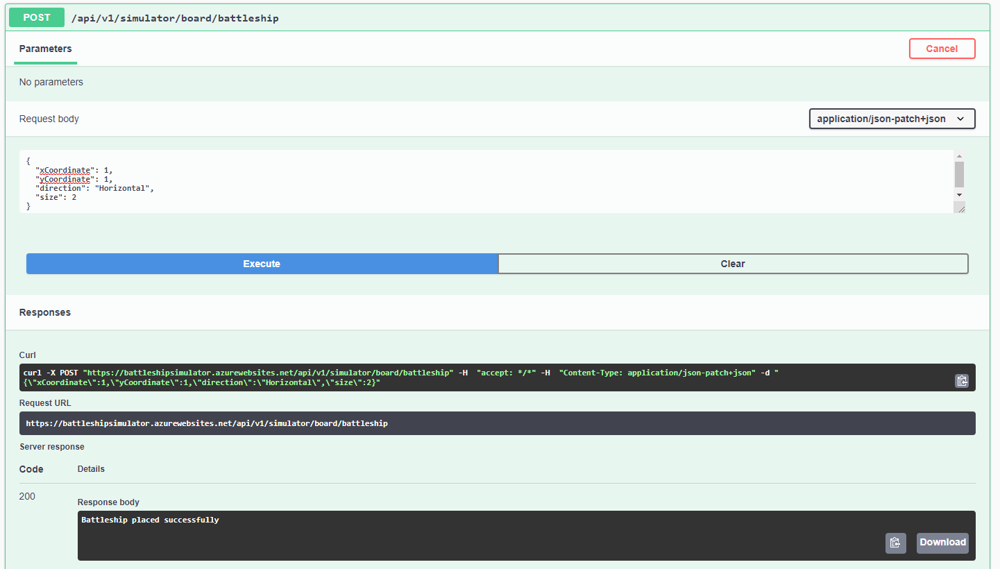

### Battleship Simulator
1. This solution is implemented using .Net Core version 3.1 and runs as a Web APi app.
2.  The root directory contains README file, demo sample images and solution file. Source code is stored under `src` folder and Unit test is stored under `Test` folder
3. As it is explained below, the projects are designed to be easily extendible and maintainable
4. Unit test scenarios cover both normal-flow and the edge-case scenarios
--- 
#### Projects design and explanation 

The high level design and structure of the solution is justified below 
The architectural design of this solution is leveraging the `Command` design pattern.

- <b>Battleship.Entities </b>
	- This project contain entities and model classes such as  `ship` , `AttackResult`, `Board`, `RequestDto` and `ResponseDto` to name a few.
- <b>Battleship.Command</b>
  -  This Project maps `Command` design pattern to  its implementation.The implementation of Command design pattern elements like <i>Receiver </i> ,<i>Invoker </i> and <i>Concrete commands </i>  are placed in this project
  -  The Receiver class : `BattleshipSimulator` contains the actual logic and implementation of all the commands
  -  The `Execute` method of command interface calls Receiver class methods. commands in this project are `Attack`, `Create Board`, `Add Battleship` etc. Furthermore.
  -   The invoker class : `SinglePlayer` calls each command specifically and pass the request object

- <b>BattleshipSimulatorApi</b>
  - This project is based on .Net core 3.1 web api runtime.
  - It provides RESTfull services to interact with the simulator .It has references to other projects and resolves the dependencies of Receiver :  `ISimulator`, Invoker: `IPlayer` classes
  - `Swagger` and `FluentValidation`
- <b>Battleship.UnitTest </b>
  - This is the unit test project. Unit test scenarios cover both happy and edge-case examples.

#### How to run the project 

The API services is deployed to Azure website and configured to work with Swagger 
https://battleshipsimulator.azurewebsites.net/

To run the application locally, Open the solution (sln file) via Visual Studio and Run the BattleShipSimulatorAPI  project using IISExpress option

<b>Live Website</b>

<b> Create Board command </b>

<b> Place a battleship  </b>

<b> Attack </b>

<b> Unit tests result </b>

